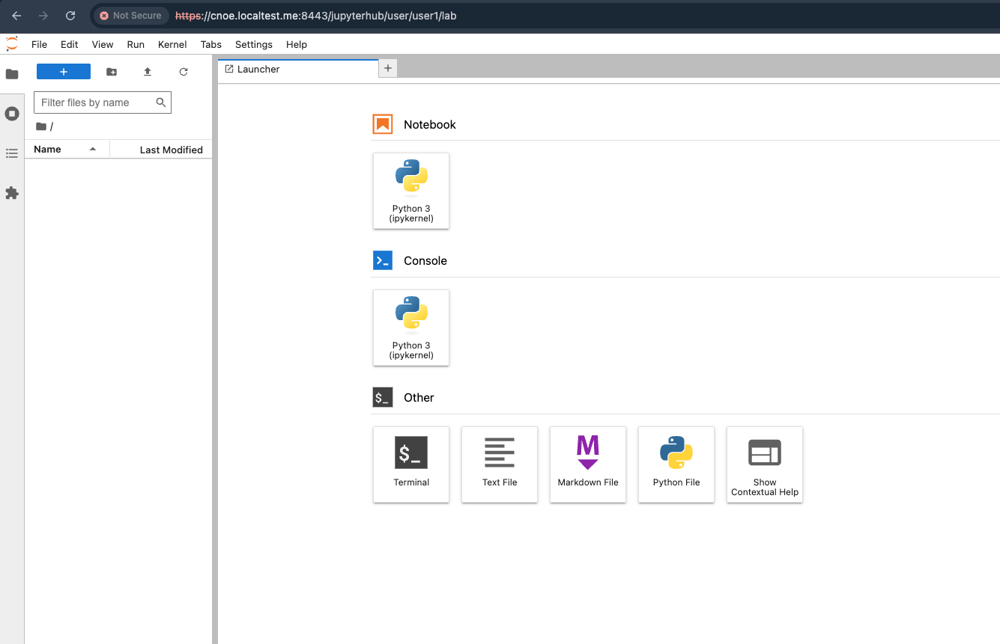

# Jupyterhub Stack

This directory contains a Jupyterhub deployment that's integrated with Keycloak

## Caveats
1) Reliance on `ref-implementation` for SSO
    - This is possible to work around by setting `authenticator_class` in the `jupyterhub.yaml` to `dummy`.

## Components
- Jupyterhub

## Installation
Note: The stack is configured to use Keycloak for SSO; therefore, the ref-implementation is required for this to work.

`idpbuilder create --use-path-routing  -p https://github.com/cnoe-io/stacks//ref-implementation -p https://github.com/cnoe-io/stacks//jupyterhub`

A `jupyterhub-config` job will be deployed into the keycloak namespace to create/patch some of the keycloak components. If deployed at the same time as the `ref-implementation`, this job will fail until the `config` job succeeds. This is normal

After some time you can verify that the ref implementation and complementing jupyterhub stack are running by checking the argoCD UI & then access the JupyterHub once everything is synced. 

Note: Some apps may require re-sync incase of failure. 

#### Accessing UIs
- Argo CD: https://cnoe.localtest.me:8443/argocd
- JupyterHub: https://cnoe.localtest.me:8443/jupyterhub

You can access these UIs using the credentials from the command. 
`idpbuilder get secrets`

Use the username **`user1`** and the password value given by `USER_PASSWORD` field to login to the backstage instance. 
Once you login it should look like this:
